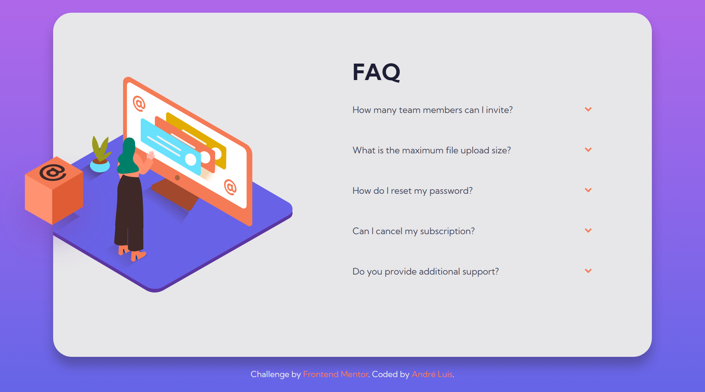
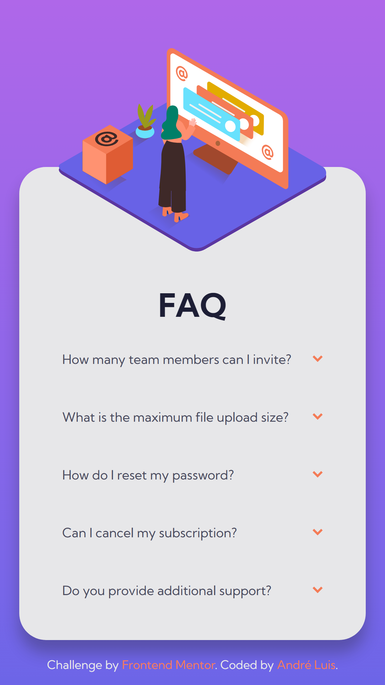

<h1 align="center"> Frontend Mentor - FAQ accordion card solution </h1>

This is a solution to the [FAQ accordion card challenge on Frontend Mentor](https://www.frontendmentor.io/challenges/faq-accordion-card-XlyjD0Oam). Frontend Mentor challenges help you improve your coding skills by building realistic projects.

 

  <a href="#-tecnologias">Tecnologias</a>&nbsp;&nbsp;&nbsp;|&nbsp;&nbsp;&nbsp;
  <a href="#-projeto">Projeto</a>&nbsp;&nbsp;&nbsp;|&nbsp;&nbsp;&nbsp;
  <a href="#-screenshots">Screenshots</a>&nbsp;&nbsp;&nbsp;|&nbsp;&nbsp;&nbsp;
  <a href="#-links">Links</a>&nbsp;&nbsp;&nbsp;

 

## 🚀 Tecnologias

Esse projeto foi desenvolvido com as seguintes tecnologias:

- HTML, CSS e JS

## 💻 Projeto

O desafio era construir esse card FAQ, com os accordions funcionais, ou seja, o usuário pode clicar sobre e ver as informações contidas, para isso foi utilizado JavaScript e CSS. Além do objetivo principal, o card se adapta responsivamente a diferentes tamanhos de tela.

## 📸 Screenshots

  
  
  

## 🌎 Links

- Solution: 
- Live Site: 

---
